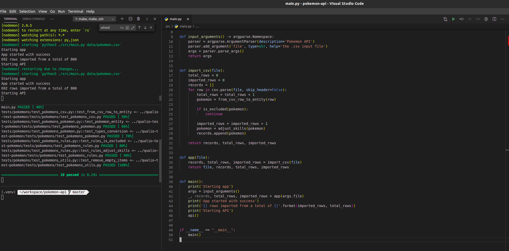

# How it works

This document explains how that solution was developed and how it can be explored.

- [Folder structure](https://docs.python-guide.org/writing/structure/)
- Commits
  - [Conventional commits](https://www.conventionalcommits.org/en/v1.0.0/)
  - Commits with the most direct value at the moment, e.g. not just the database but the code using it
  - Sure it can vary according to the complexity of the steps and the task at the moment
- [Clean Architecture](https://blog.cleancoder.com/uncle-bob/2012/08/13/the-clean-architecture.html)
  - Do not mix entities, use cases, controllers, and drivers (e.g. HTTP)
  - Quoting the guide:
    - Independent of Frameworks. The architecture does not depend on the existence of some library of feature laden software. This allows you to use such frameworks as tools, rather than having to cram your system into their limited constraints.
    - Testable. The business rules can be tested without the UI, Database, Web Server, or any other external element.
    - Independent of UI. The UI can change easily, without changing the rest of the system. A Web UI could be replaced with a console UI, for example, without changing the business rules.
    - Independent of Database. You can swap out Oracle or SQL Server, for Mongo, BigTable, CouchDB, or something else. Your business rules are not bound to the database.
    - Independent of any external agency. In fact your business rules simply don’t know anything at all about the outside world.

## References

- https://12factor.net
- https://restfulapi.net
- [The Zen of Python](https://www.python.org/dev/peps/pep-0020/)
- Luciano Ramalho's ["Fluent Python"](https://www.amazon.com.br/Fluent-Python-Luciano-Ramalho/dp/1491946008)
- [The Hitchhiker&#39;s Guide to Python](https://docs.python-guide.org/)
- Uncle Bob's ["Clean Code"](https://www.amazon.com.br/Clean-Code-Handbook-Software-Craftsmanship-ebook/dp/B001GSTOAM)
- Uncle Bob's ["Clean Architecture"](https://www.amazon.com/Clean-Architecture-Craftsmans-Software-Structure/dp/0134494164)
- Martin Fowler's [Microservices recommendations](https://martinfowler.com/articles/microservices.html)

## IDE

Recommended dev flow:

- [Visual Studio Code](https://code.visualstudio.com/)
- Start `make dev` on first terminal
- Start `make tests` on second terminal
- Third terminal is generic

